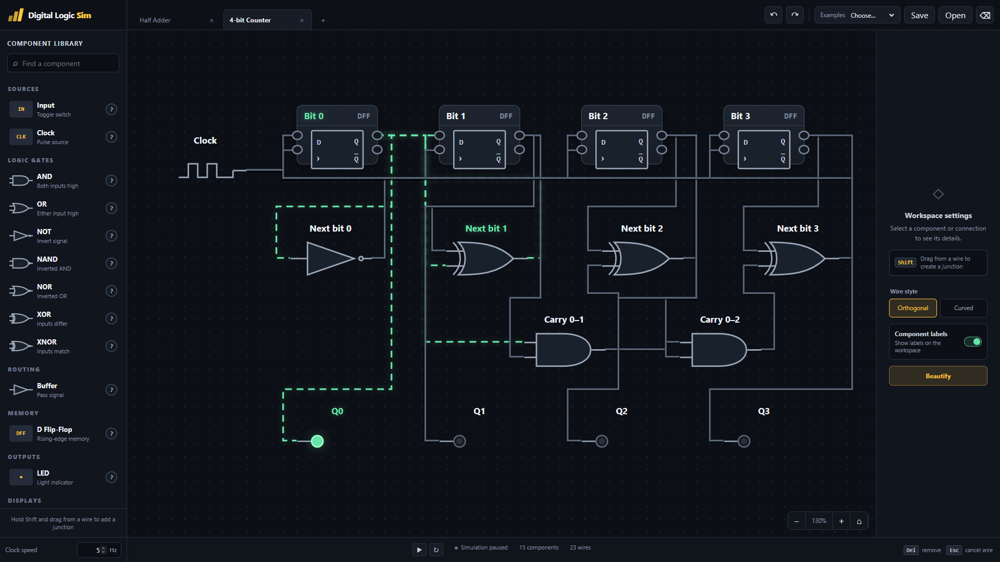

# Digital Logic Sim

A browser-based playground for building and simulating digital logic circuits, with a dark circuit editor and animated signal flow.



- Build circuits with logic gates, switches, clocks, D flip-flops, LEDs, and a 4×4 LED matrix.
- Explore the premade Half Adder and synchronous 4-bit Counter examples.
- Draw orthogonal or curved wires, drag wire segments, and hold **Shift** while dragging from a wire to create a junction.
- Adjust simulation speed, pause or restart, and inspect component signals.
- Organize circuits in tabs, save/open JSON files, undo/redo edits, and beautify wiring.
- Pan and zoom, show or hide labels, and double-click empty workspace to toggle the side panels.

## Run locally

With Node.js installed (no additional packages required):

```sh
git clone https://github.com/yardimli/digital-logic-sim-incremental.git
cd digital-logic-sim-incremental
npm run dev
```

Open [localhost:4173](http://localhost:4173).

`npm test` runs the simulation and routing tests. `npm run build` copies the app and favicon into `dist/` for static hosting.
